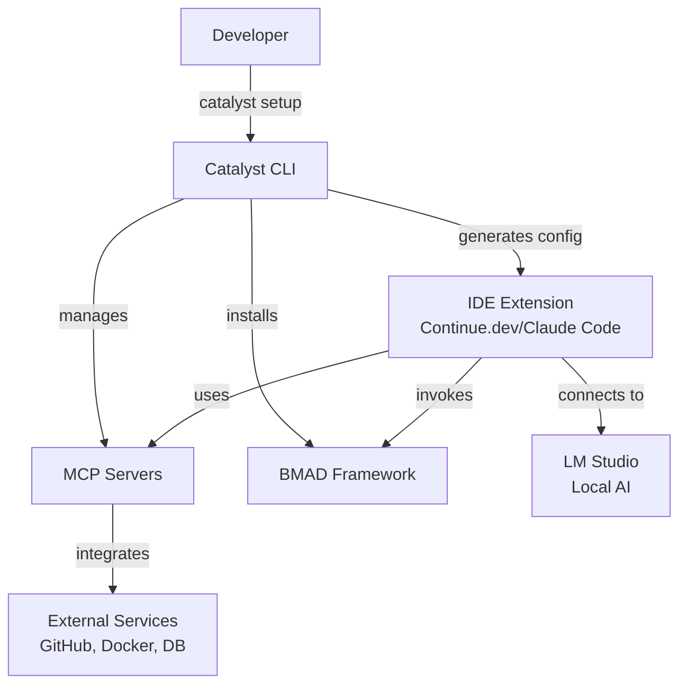

# Catalyst Architecture Overview

**Version:** 0.1.0
**Last Updated:** October 26, 2025

[Back to Architecture Index](README.md)

---

## Introduction

### Purpose

This document defines the complete architecture for **Catalyst**, a Homebrew-distributed development environment that combines:
- **CLI Tool** (TypeScript/Node.js) for setup, configuration, and management
- **MCP Servers** (TypeScript/Node.js) for AI tool integration
- **BMAD Framework** for structured development methodology
- **Build Pipeline** (GitHub Actions) for automated releases
- **Distribution** (Homebrew) for easy installation and updates

This architecture supports AI-driven development by providing clear boundaries, interfaces, and patterns that enable agents to work effectively across the entire system.

### Architectural Goals

1. **Single Runtime** - Use only Node.js for CLI and MCP servers
2. **Type Safety** - TypeScript throughout for reliability
3. **Simple Distribution** - Homebrew-native packaging
4. **Extensibility** - Easy to add new MCP servers
5. **Developer Experience** - Simple setup, clear commands
6. **Maintainability** - Clear separation of concerns

### Change Log

| Date | Version | Description | Author |
|------|---------|-------------|--------|
| 2025-10-26 | 0.1.0 | Initial architecture (TypeScript/Node.js) | Architecture Team |

---

## High-Level Architecture

### System Overview

Catalyst uses a **three-tier architecture**:

```
┌─────────────────────────────────────────────────────────────┐
│                 Tier 1: Distribution Layer                   │
│                      (Homebrew)                              │
│  • Package management via brew                              │
│  • Version resolution and dependencies                      │
│  • Global installation at /opt/homebrew/                   │
└─────────────────┬───────────────────────────────────────────┘
                  │
┌─────────────────▼───────────────────────────────────────────┐
│              Tier 2: Global Configuration                    │
│                 (~/.catalyst, ~/.bmad-core)                  │
│                                                             │
│  Catalyst CLI (TypeScript/Node.js)                         │
│  ├── Installation Manager                                   │
│  ├── Configuration Manager                                  │
│  ├── MCP Server Manager                                     │
│  ├── BMAD Installer                                         │
│  ├── IDE Detector                                           │
│  └── Verification Tools                                     │
│                                                             │
│  MCP Servers (TypeScript/Node.js)                          │
│  ├── Docker MCP (custom)                                    │
│  ├── PostgreSQL MCP (custom)                               │
│  ├── Xcode MCP (custom)                                     │
│  ├── Storybook MCP (custom)                                │
│  ├── Vite MCP (custom)                                      │
│  └── Official/Community MCPs                               │
│                                                             │
│  BMAD Framework                                             │
│  ├── 10 Agent Definitions                                   │
│  ├── 24 Task Templates                                      │
│  ├── 14 Document Templates                                  │
│  └── 6 Workflows                                            │
└─────────────────┬───────────────────────────────────────────┘
                  │
┌─────────────────▼───────────────────────────────────────────┐
│           Tier 3: Per-Project Configuration                 │
│                  (Lightweight)                              │
│                                                             │
│  Project Settings                                           │
│  ├── .catalyst/config.yaml                                  │
│  ├── .bmad-core/core-config.yaml                           │
│  └── .env                                                   │
└─────────────────────────────────────────────────────────────┘
```

### Component Interaction Diagram



### Architectural Patterns

#### 1. **Command Pattern** (CLI)
- Each CLI command is a separate module
- Commands are composable and testable
- Clear separation between CLI parsing and business logic

**Rationale:** Enables easy addition of new commands without modifying existing code.

#### 2. **Plugin Architecture** (MCP Servers)
- MCP servers are independent plugins
- Standard protocol for communication
- Can be added/removed without affecting core

**Rationale:** Extensibility is core to Catalyst's value proposition.

#### 3. **Configuration as Code**
- YAML configuration files
- Type-validated using Zod schemas
- Environment variable interpolation

**Rationale:** Makes configurations versionable and shareable.

#### 4. **Orchestration Pattern** (CLI as Orchestrator)
- CLI coordinates between components
- Does not implement business logic itself
- Delegates to specialized modules

**Rationale:** Keeps CLI thin and maintainable.

---

## Related Sections

- [Technology Stack](02-technology-stack.md) - Detailed technology choices and rationale
- [CLI Architecture](03-cli-architecture.md) - Command structure and implementation
- [MCP Server Architecture](04-mcp-server-architecture.md) - MCP server design patterns
