# Build & Release Architecture

**Version:** 2.0.0
**Last Updated:** October 26, 2025

[Back to Architecture Index](README.md)

---

## Build Process Overview

```mermaid
graph LR
    Tag[Git Tag v*] --> CI[GitHub Actions]
    CI --> Deps[Install Dependencies]
    Deps --> Build[Build CLI]
    Build --> Test[Run Tests]
    Test --> BMAD[Install BMAD]
    BMAD --> MCP[Build MCP Servers]
    MCP --> Package[Create Tarball]
    Package --> Release[GitHub Release]
    Release --> Tap[Update Homebrew Tap]
```



---

## GitHub Actions Workflow

**File:** `.github/workflows/release.yml`

```yaml
name: Build and Release Catalyst

on:
  push:
    tags:
      - 'v*'

jobs:
  build-and-release:
    runs-on: macos-latest

    steps:
      - name: Checkout
        uses: actions/checkout@v4

      - name: Setup Node.js 20
        uses: actions/setup-node@v4
        with:
          node-version: '20'
          cache: 'npm'

      - name: Install Dependencies
        run: npm ci

      - name: Build CLI
        run: npm run build

      - name: Run Tests
        run: npm test

      - name: Install BMAD Method
        run: |
          chmod +x scripts/*.sh
          ./scripts/install-bmad.sh

      - name: Build MCP Servers
        run: ./scripts/build-mcp-servers.sh

      - name: Build Release Package
        run: ./scripts/build.sh

      - name: Calculate SHA256
        id: sha
        run: |
          SHA=$(shasum -a 256 build/catalyst-*.tar.gz | awk '{print $1}')
          echo "SHA256=$SHA" >> $GITHUB_OUTPUT

      - name: Create GitHub Release
        uses: softprops/action-gh-release@v1
        with:
          files: build/catalyst-*.tar.gz
          body_path: CHANGELOG.md

      - name: Update Homebrew Tap
        run: |
          VERSION=${GITHUB_REF#refs/tags/v}
          # Clone tap repository
          git clone https://${{ secrets.GITHUB_TOKEN }}@github.com/${{ github.repository_owner }}/homebrew-catalyst.git
          cd homebrew-catalyst

          # Update formula
          sed -i '' "s|url \".*\"|url \"https://github.com/${{ github.repository_owner }}/catalyst/releases/download/v${VERSION}/catalyst-${VERSION}.tar.gz\"|" Formula/catalyst.rb
          sed -i '' "s/sha256 \".*\"/sha256 \"${{ steps.sha.outputs.SHA256 }}\"/" Formula/catalyst.rb
          sed -i '' "s/version \".*\"/version \"${VERSION}\"/" Formula/catalyst.rb

          # Commit and push
          git config user.name "github-actions[bot]"
          git config user.email "github-actions[bot]@users.noreply.github.com"
          git add Formula/catalyst.rb
          git commit -m "catalyst ${VERSION}"
          git push
```

---

## Build Scripts

### `scripts/build.sh`

```bash
#!/bin/bash
set -e

VERSION=$(node -p "require('./package.json').version")

echo "🏗️  Building Catalyst ${VERSION}..."

# 1. Clean previous build
rm -rf build/
mkdir -p build/catalyst

# 2. Install production dependencies
echo "📦 Installing dependencies..."
npm ci --production

# 3. Copy compiled CLI
echo "📋 Copying CLI..."
mkdir -p build/catalyst/dist
cp -r dist/* build/catalyst/dist/

# 4. Copy node_modules
echo "📚 Copying dependencies..."
cp -r node_modules build/catalyst/

# 5. Copy source files
echo "📄 Copying project files..."
cp -r bin templates config docs build/catalyst/
cp package.json package-lock.json tsconfig.json LICENSE README.md build/catalyst/

# 6. Copy MCP servers
echo "🔧 Copying MCP servers..."
mkdir -p build/catalyst/mcp-servers
for server in docker postgres xcode storybook vite; do
  if [ -d "mcp-servers/${server}/dist" ]; then
    mkdir -p build/catalyst/mcp-servers/${server}
    cp -r mcp-servers/${server}/dist build/catalyst/mcp-servers/${server}/
    cp mcp-servers/${server}/package.json build/catalyst/mcp-servers/${server}/
  fi
done

# 7. Copy BMAD bundles
echo "📚 Copying BMAD bundles..."
mkdir -p build/catalyst/bundles
cp -r .bmad-* build/catalyst/bundles/ 2>/dev/null || true

# 8. Create tarball
echo "📦 Creating tarball..."
cd build
tar -czf "catalyst-${VERSION}.tar.gz" catalyst/
cd ..

# 9. Calculate checksum
SHA256=$(shasum -a 256 "build/catalyst-${VERSION}.tar.gz" | awk '{print $1}')

echo ""
echo "✅ Build complete!"
echo "📦 Package: build/catalyst-${VERSION}.tar.gz"
echo "🔐 SHA256: ${SHA256}"
echo ""
```

### `scripts/build-mcp-servers.sh`

```bash
#!/bin/bash
set -e

echo "🔧 Building MCP servers..."

MCP_SERVERS="docker postgres xcode storybook vite"

for server in $MCP_SERVERS; do
  if [ -d "mcp-servers/${server}" ]; then
    echo "  Building ${server}..."
    cd "mcp-servers/${server}"
    npm ci
    npm run build
    cd ../..
  else
    echo "  ⚠️  Warning: mcp-servers/${server} not found"
  fi
done

echo "✅ MCP servers built successfully"
```

### `scripts/install-bmad.sh`

```bash
#!/bin/bash
set -e

echo "📚 Installing BMAD Method..."

# Install BMAD with full configuration
npx bmad-method install \
  --full \
  --expansion-packs all \
  --ides all \
  --yes

# Verify installation
if [ -d ".bmad-core" ]; then
  echo "✅ BMAD installed successfully"
  ls -la .bmad-core/
else
  echo "❌ BMAD installation failed"
  exit 1
fi
```

---

## Related Sections

- [Technology Stack](02-technology-stack.md) - Build tools and CI/CD technologies
- [Deployment Architecture](12-deployment-architecture.md) - Homebrew distribution and versioning
- [Development Workflow](11-development-workflow.md) - Local build and testing
