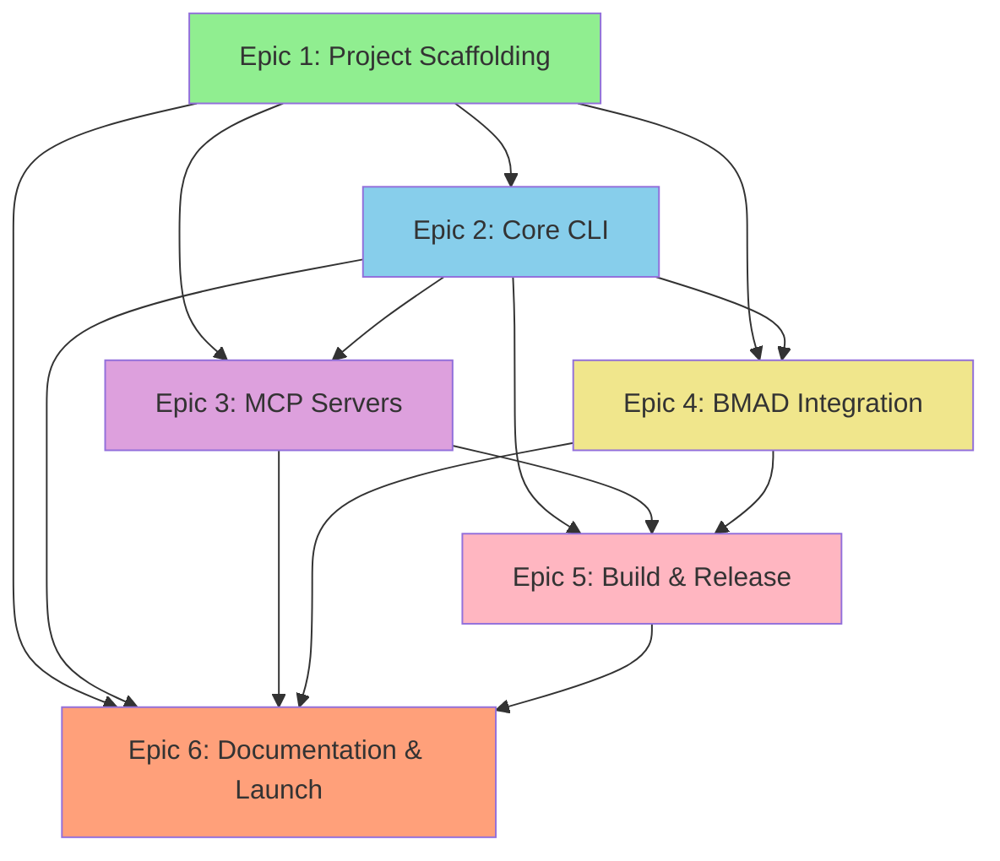

# Catalyst Implementation Sequence & Dependencies

**Version:** 1.0
**Last Updated:** October 26, 2025
**Status:** Approved for Development

---

## Overview

This document defines the implementation sequence for Catalyst development, including epic dependencies, story order, and critical path analysis. This sequence ensures that foundational components are built before dependent features.

---

## Epic Dependency Graph

---

## Implementation Phases

### Phase 1: Foundation (Epic 1) - Week 1-2
**Goal:** Establish development environment, project structure, and **open-source community foundation**

**Critical Path:**
1. Epic 1.1: Initialize TypeScript Project Structure
2. Epic 1.2: Set Up Testing Infrastructure
3. Epic 1.3: Configure Build and Development Scripts
4. Epic 1.4: Create Core Utility Modules
5. Epic 1.5: Set Up Local Development Workflow
6. **Epic 1.6: Set Up Open-Source Community Foundation** (NEW - OSS governance)
7. **Epic 1.7: Create Multi-Audience Top-Level README** (NEW - multi-audience docs)
8. **Epic 1.8: Configure GitHub Repository for Community** (NEW - GitHub setup)
9. Epic 1.9: Initialize Git Repository and First Commit

**Deliverable:** Working TypeScript project with build, test infrastructure, **and complete OSS community readiness**

**Blocking:** Nothing (first phase)
**Enables:** All other epics
**Community Impact:** Repository is contribution-ready from day one

---

### Phase 2: CLI Foundation (Epic 2) - Week 3-5
**Goal:** Build functional CLI with core commands

**Story Order:**
1. **2.1: Main CLI Entry Point** (FIRST - enables all other CLI commands)
2. **2.2: Environment Detector** (SECOND - needed by setup command)
3. **2.3: Configuration Manager** (THIRD - needed by all commands that read/write config)
4. **2.4: Keychain Integration** (FOURTH - needed before setup prompts for API keys)
5. **2.5: `catalyst setup` Command** (uses 2.2, 2.3, 2.4)
6. **2.6: `catalyst init` Command** (uses 2.3)
7. **2.7: `catalyst verify` Command** (uses 2.3)
8. **2.8: `catalyst config` Command** (uses 2.3)

**Deliverable:** Functional `catalyst` CLI with setup, init, verify, config commands

**Blocking:** Epic 1
**Enables:** Epic 3 (MCP commands), Epic 4 (BMAD commands), Epic 5 (build targets)

---

### Phase 3A: MCP Server Framework (Epic 3) - Week 6-10
**Goal:** Implement all MCP servers and management

**Story Order:**
1. **3.1: MCP Registry and Manager** (FIRST - foundation for all MCP work)
2. **3.2: `catalyst mcp` Commands** (SECOND - uses 3.1)
3. **3.3: MCP IDE Configuration Generator** (THIRD - generates configs for servers)
4. **3.4-3.8: Build Individual MCP Servers** (PARALLEL - can be done concurrently)
   - 3.4: Docker MCP Server
   - 3.5: PostgreSQL MCP Server
   - 3.6: Xcode MCP Server
   - 3.7: Storybook MCP Server
   - 3.8: Vite MCP Server
5. **3.9: Configure Official MCP Servers** (AFTER 3.1, 3.2)
6. **3.10: MCP Testing Framework** (LAST - tests all servers)

**Deliverable:** All 12 MCP servers functional and manageable via CLI

**Blocking:** Epic 1, Epic 2
**Enables:** Epic 6 (MCP documentation)
**Parallel With:** Phase 3B (Epic 4)

---

### Phase 3B: BMAD Integration (Epic 4) - Week 6-8
**Goal:** Integrate BMAD methodology framework

**Story Order:**
1. **4.1: BMAD Installer Module** (FIRST - installs BMAD)
2. **4.2: BMAD Symlink Manager** (SECOND - uses 4.1 output)
3. **4.3: BMAD Version Management** (THIRD - manages updates)
4. **4.4: `catalyst update` Command** (FOURTH - uses 4.3)
5. **4.5: BMAD IDE Integration** (LAST - configures IDE access)

**Deliverable:** BMAD fully integrated with Catalyst

**Blocking:** Epic 1, Epic 2
**Enables:** Epic 6 (BMAD documentation)
**Parallel With:** Phase 3A (Epic 3)

---

### Phase 4: Build & Release Pipeline (Epic 5) - Week 11-13
**Goal:** Automate building and distribution

**Story Order:**
1. **5.1: Create Build Scripts** (FIRST - foundation for all builds)
2. **5.2: Create Homebrew Formula** (SECOND - uses 5.1 output)
3. **5.3: GitHub Actions: CI Workflow** (THIRD - enables automated testing)
4. **5.4: GitHub Actions: Test Workflow** (FOURTH - comprehensive testing)
5. **5.5: GitHub Actions: Release Workflow** (FIFTH - uses 5.1, 5.2)
6. **5.6: Homebrew Tap Auto-Update** (SIXTH - uses 5.5)
7. **5.7: Version Management** (PARALLEL with others)

**Deliverable:** Fully automated CI/CD pipeline and Homebrew distribution

**Blocking:** Epic 1, Epic 2, Epic 3, Epic 4
**Enables:** Public release capability

---

### Phase 5: Documentation & Launch (Epic 6) - Week 14-16
**Goal:** Polish and prepare for public launch

**Story Order:**
1. **6.3: CLI Help Text** (FIRST - quick win, improves UX immediately)
2. **6.4: Error Messages** (SECOND - improves UX)
3. **6.5: `catalyst doctor` Command** (THIRD - troubleshooting tool)
4. **6.1: User Guide** (FOURTH - comprehensive docs)
5. **6.2: Developer Guide** (FIFTH - contributor docs)
6. **6.6: MCP Server API Docs** (SIXTH - technical reference)
7. **6.7: Video Tutorials** (SEVENTH - visual learning)
8. **6.8: Launch Checklist** (LAST - final preparation)

**Deliverable:** Complete documentation and launch-ready product

**Blocking:** Epic 1-5 (all previous epics)
**Enables:** Public launch

---

## Story Dependencies by Epic

### Epic 1: Sequential with OSS Stories at End
**Order:** 1.1 → 1.2 → 1.3 → 1.4 → 1.5 → **1.6 (OSS Foundation)** → **1.7 (README)** → **1.8 (GitHub Config)** → 1.9 (Git Init)

**Rationale:** OSS governance files (1.6) should exist before README (1.7) references them, and both should exist before Git initialization (1.9) commits them.

### Epic 2: Dependencies
- 2.5 (setup) depends on: 2.1, 2.2, 2.3, 2.4
- 2.6 (init) depends on: 2.1, 2.3
- 2.7 (verify) depends on: 2.1, 2.3
- 2.8 (config) depends on: 2.1, 2.3

### Epic 3: Dependencies
- 3.2 (mcp commands) depends on: 3.1 (registry)
- 3.3 (IDE config) depends on: 3.1, 3.2
- 3.4-3.8 (MCP servers) depend on: 3.1 (all can be parallel)
- 3.9 (official MCPs) depends on: 3.1, 3.2
- 3.10 (testing) depends on: 3.4-3.9 (all servers)

### Epic 4: Dependencies
- 4.2 (symlinks) depends on: 4.1 (installer)
- 4.3 (version mgmt) depends on: 4.1, 4.2
- 4.4 (update command) depends on: 4.3
- 4.5 (IDE integration) depends on: 4.1, 4.2

### Epic 5: Dependencies
- 5.2 (formula) depends on: 5.1 (build scripts)
- 5.5 (release workflow) depends on: 5.1, 5.2, 5.3, 5.4
- 5.6 (tap update) depends on: 5.5
- 5.7 (versioning) can be parallel

### Epic 6: Dependencies
- 6.5 (doctor) depends on: 6.4 (error messages)
- 6.1 (user guide) depends on: 6.3 (help text)
- 6.6 (MCP docs) depends on: Epic 3 complete
- 6.8 (launch) depends on: all others

---

---

## New OSS Community Stories (Epic 1)

**1.6: OSS Foundation**
- LICENSE, CODE_OF_CONDUCT, CODEOWNERS
- Issue/PR templates
- SECURITY.md
- Author metadata: azywicki <81277290+NimbleEngineer21@users.noreply.github.com>

**1.7: Multi-Audience README**
- Hero section for all audiences
- What is Catalyst (plain language)
- Quick start for users
- Docs by audience (users, devs, contributors)
- Community links
- Template: [docs/stories/templates/README-template-example.md](templates/README-template-example.md)

**1.8: GitHub Repository Config**
- Repository metadata and topics
- GitHub Discussions enabled
- Issue labels configured
- Branch protection rules
- Social preview image

**Impact:** Catalyst is community-ready from first commit, lowering barrier to external contributions.

**Reference:** [OSS Community Readiness Plan](OSS_COMMUNITY_READINESS.md)

---

## Updated Story Counts

**Total Stories:** 47 (was 44)
- Epic 1: **9 stories** (was 6) - Added 3 OSS stories
- Epic 2: 8 stories
- Epic 3: 10 stories
- Epic 4: 5 stories
- Epic 5: 7 stories
- Epic 6: 8 stories (Story 6.2 enhanced for community)

---

## Critical Path Analysis

**Critical Path:** Epic 1 → Epic 2 → Epic 5 → Epic 6 (Launch)

**Longest Dependency Chain:**
1. Epic 1.1 (TypeScript setup)
2. Epic 1.4 (Core utilities)
3. Epic 2.1 (CLI entry point)
4. Epic 2.3 (Config manager)
5. Epic 3.1 (MCP registry)
6. Epic 3.4-3.8 (MCP servers - 5 weeks in parallel)
7. Epic 5.1 (Build scripts)
8. Epic 5.5 (Release workflow)
9. Epic 6.8 (Launch)

**Estimated Total Time:** 16 weeks (4 months)

**Parallelization Opportunities:**
- Week 6-10: Epic 3 (MCP Servers) + Epic 4 (BMAD) in parallel
- Within Epic 3: Stories 3.4-3.8 (5 MCP servers) can be built concurrently
- Within Epic 6: Stories 6.1, 6.2, 6.6, 6.7 can be parallel

---

## Risk Mitigation in Sequencing

### Risk 1: BMAD Installation Complexity
**Mitigation:** Epic 4 (BMAD) starts early (week 6) and runs parallel with Epic 3
**Fallback:** If BMAD blocks, continue with MCP servers

### Risk 2: MCP Server Development Taking Longer
**Mitigation:** MCP servers (3.4-3.8) parallelized across 5 weeks
**Fallback:** Start with essential servers (Docker, PostgreSQL), defer others to post-MVP

### Risk 3: Homebrew Formula Rejection
**Mitigation:** Epic 5.2 (Formula) early in Phase 4, allows time for revision
**Fallback:** Direct download distribution if Homebrew blocked

### Risk 4: Documentation Delays Launch
**Mitigation:** Epic 6 starts with high-impact items (help text, error messages)
**Fallback:** Launch with minimal docs, expand post-release

---

## Development Team Recommendations

### Sprint Planning (2-week sprints)

**Sprint 1 (Week 1-2):** Epic 1 complete
**Sprint 2 (Week 3-4):** Epic 2 stories 2.1-2.4
**Sprint 3 (Week 5-6):** Epic 2 stories 2.5-2.8 + Epic 3 story 3.1 + Epic 4 story 4.1
**Sprint 4 (Week 7-8):** Epic 3 stories 3.2-3.3 + MCP servers 3.4-3.5 + Epic 4 stories 4.2-4.3
**Sprint 5 (Week 9-10):** Epic 3 stories 3.6-3.10 + Epic 4 stories 4.4-4.5
**Sprint 6 (Week 11-12):** Epic 5 stories 5.1-5.5
**Sprint 7 (Week 13-14):** Epic 5 stories 5.6-5.7 + Epic 6 stories 6.1-6.3
**Sprint 8 (Week 15-16):** Epic 6 stories 6.4-6.8 + Launch preparation

### Team Structure Recommendation

**1 Developer (Full-Stack):**
- Follow sequential path strictly
- Focus on critical path
- Timeline: 16-20 weeks

**2 Developers:**
- Developer 1: Epic 1 → Epic 2 → Epic 3 → Epic 5
- Developer 2: Epic 1 (help) → Epic 4 → Epic 3 (MCP servers) → Epic 6
- Timeline: 12-14 weeks

**3+ Developers:**
- Developer 1: Epics 1, 2, 5 (core CLI and build)
- Developer 2: Epic 3 (MCP servers - servers 3.4, 3.6, 3.8)
- Developer 3: Epic 4 + Epic 3 (MCP servers - servers 3.5, 3.7) + Epic 6
- Timeline: 10-12 weeks

---

## Definition of Ready (Before Starting Each Epic)

### Epic 1
- ✅ Repository created
- ✅ PRD and Architecture approved

### Epic 2
- ✅ Epic 1 complete
- ✅ TypeScript compilation working
- ✅ Core utilities tested

### Epic 3
- ✅ Epic 1 complete
- ✅ Epic 2 stories 2.1-2.3 complete (need config manager)
- ✅ MCP SDK installed

### Epic 4
- ✅ Epic 1 complete
- ✅ Epic 2 stories 2.1-2.3 complete
- ✅ BMAD npm package accessible

### Epic 5
- ✅ All Epics 1-4 complete
- ✅ Manual build tested locally
- ✅ GitHub repository configured

### Epic 6
- ✅ All Epics 1-5 complete
- ✅ All features functionally complete
- ✅ Beta testing conducted

---

## Success Criteria Progression

| Epic | % of MVP Complete | Key Deliverable |
|------|-------------------|-----------------|
| Epic 1 | 10% | Development environment ready |
| Epic 2 | 35% | Functional CLI |
| Epic 3 | 65% | MCP servers working |
| Epic 4 | 80% | BMAD integrated |
| Epic 5 | 95% | Automated releases |
| Epic 6 | 100% | Launch ready |

---

## Next Steps

1. **Review this sequence** with the team
2. **Create first sprint plan** (Epic 1, Stories 1.1-1.6)
3. **Set up project tracking** (GitHub Projects or equivalent)
4. **Begin Epic 1, Story 1.1** (Initialize TypeScript Project Structure)
5. **Schedule sprint ceremonies** (planning, standup, retro)

---

**Status:** Ready for development to begin
**Approved By:** Product Owner (PO Agent)
**Next Review:** After Epic 1 completion
